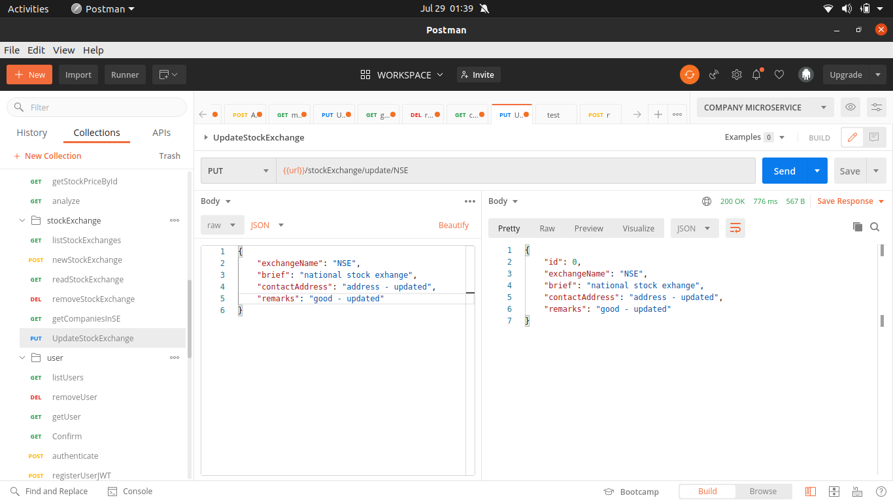
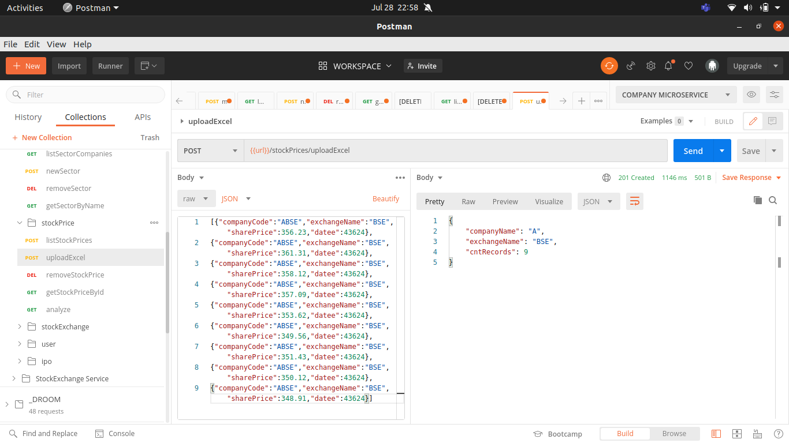
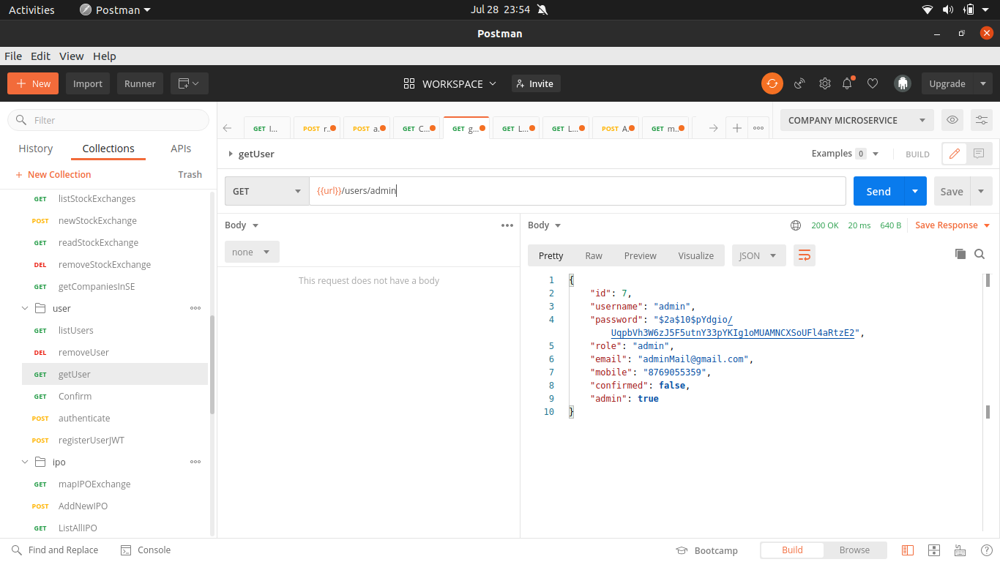
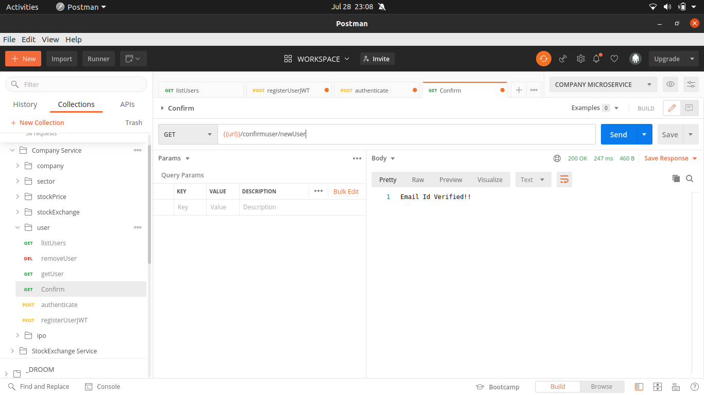

<p align="center">

 
 <h2 align="center">Stoxapp</h2>
 <p align="center">
A platform to create, manage and analyze stocks, sectors, stock exhanges and ipos.</p>
</p>
## What is it?

This is the backend service for the [Stock Market Charting - React].

## Checkout Directly
[stoxapp.herokuapp.com]

## Installation
To build and deploy the project.
```
mvn spring-boot:run 
```
OR

To build the project
```
mvn clean package
``` 
```
cd target
```
```
java -jar company-0.0.1-SNAPSHOT.jar
```

## APIs
The APIs for the service is corresponding to the following:

- Company
- Stock Exchange
- Sectors
- Stock Price
- User
- IPO Details

### Company APIs
- company-get


- company-list


- company-mapExchange


- company-new


- company-patternfilter


- company-update


### IPO APIs
- ipo-get


- ipo-list


- ipo-listupcoming


- ipo-mapExchange


- ipo-new


- ipo-update


### Sector APIs
- sector-get


- sector-list


- sector-listcompanies


- sector-new


- sector-update


### Stock Exchange APIs
- stockexchange-get


- stockexchange-list


- stockexchange-listcompanies


- stockexchange-new


- stockexchange-update



### Stock Price APIs
- stockprice-compare


- stockprice-uploadexcel



### User APIs
- users-get



- users-list


- users-register


- users-authenticate


- users-confirm



- users-update


## Version
v0.0.1


[Stock Market Charting - React]: <https://github.com/aks010/stockMarket-react>
[stoxapp.herokuapp.com]:<http://stoxapp.herokuapp.com/>